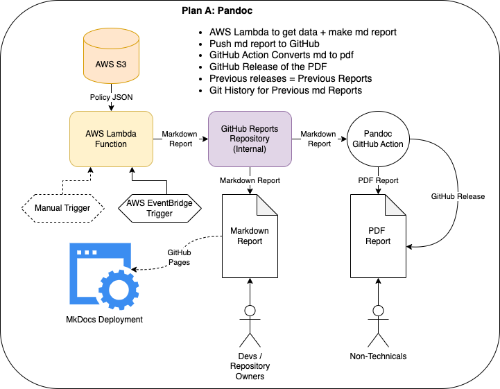

# Organisation Snapshotting Lambda
A PoC script to produce a Markdown Report using GitHub Policy Data and push it to a GitHub Repository.

## Contents

- [Contents](#contents)
- [Getting Started](#getting-started)
- [Design](#design)
  - [Process Flow](#process-flow)

## Getting Started

1. Clone the repository:
    ```bash
    git clone https://github.com/ONS-Innovation/org-snapshotting-poc
    ```
2. Navigate to the project directory:
    ```bash
    cd org-snapshotting-poc
    ```
3. Create and activate a virtual environment:
    ```bash
    python -m venv venv
    source venv/bin/activate  # On Windows use `venv\Scripts\activate`
    ```
4. Install the required packages:
    ```bash
    poetry install
    ```
5. Set up the environment variables:
    ```bash
    export AWS_ACCESS_KEY_ID=<aws_access_key_id> 
    export AWS_SECRET_ACCESS_KEY=<aws_secret_access_key_id>
    export AWS_SECRET_NAME=<path_to_pem_file>
    export GITHUB_ORG=<github_org>
    export GITHUB_APP_CLIENT_ID=<github_app_client_id>
    export ENVIRONMENT=<sdp-prod|sdp-dev>
    ```
6. Run the application:
    ```bash
    python3 src/main.py
    ```

This will generate a markdown report and push it to the specified GitHub repository.

## Design



### Process Flow

1. Get JSON Data from AWS S3.
2. Process the JSON data to produce a markdown report.
3. Push the markdown report to a GitHub repository.
4. Setup a GitHub Action to convert the markdown report to PDF (Pandoc).
5. Release the PDF report to a GitHub release.
6. MkDocs Setup to host the markdown report on GitHub Pages (Optional).
