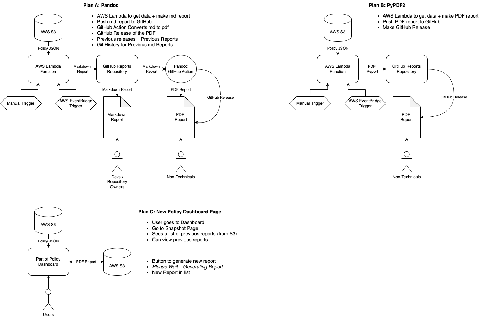

# Organisation Snapshotting PoC
A PoC tool to produce a PDF report from GitHub Policy Data.

## Contents

- [Contents](#contents)
- [Getting Started](#getting-started)
- [Designs](#designs)

## Getting Started

1. Clone the repository:
    ```bash
    git clone https://github.com/ONS-Innovation/org-snapshotting-poc
    ```
2. Navigate to the project directory:
    ```bash
    cd org-snapshotting-poc
    ```
3. Create and activate a virtual environment:
    ```bash
    python -m venv venv
    source venv/bin/activate  # On Windows use `venv\Scripts\activate`
    ```
4. Install the required packages:
    ```bash
    poetry install
    ```
5. Set up the environment variables:
    ```bash
    TBC
    ```
6. Run the application:
    ```bash
    streamlit run src/main.py
    ```

Go to `http://localhost:8501` in your web browser to view the application.

## Designs


